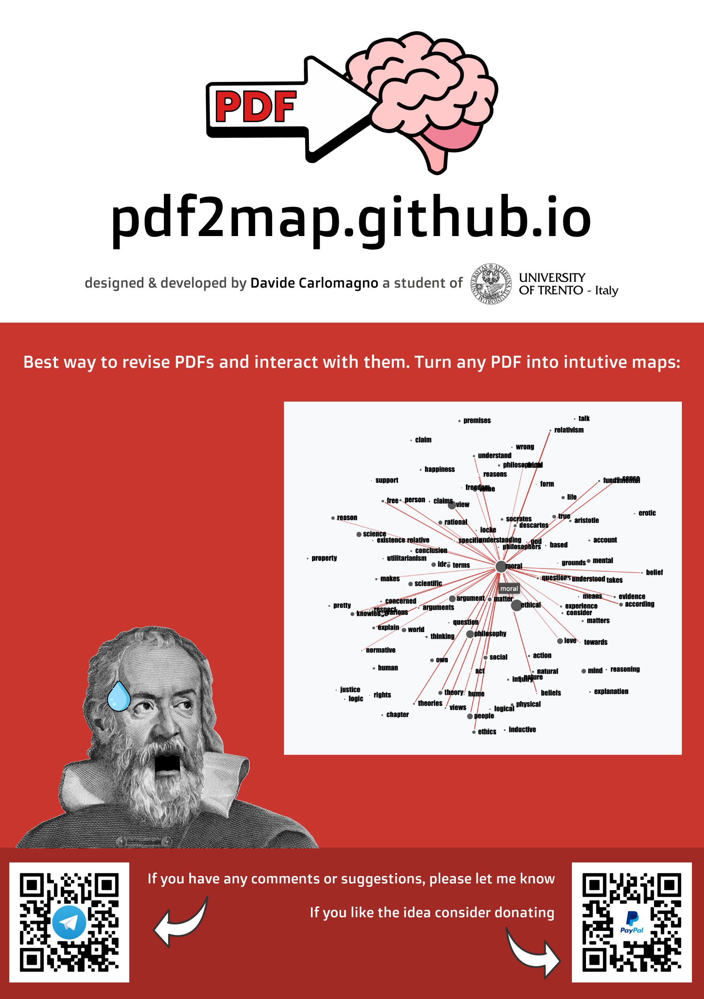

# pdf2map ✨

As the title suggests, I created this useful web app to let people upload their not-scanned pdfs and turned them into interactive maps.

## Why?

I started this project as a side project, I was in need of something that could help me visualize the links between topics written in the pdfs given to me during lectures.

## How to use

First of all, let me thank you for the time you are spending reading this type of digital paper. Second here some instructions on how to use the website:
1. You can upload your not-scanned pdf by clicking on the *Upload File*
2. Now you want to choose which, of the most recurring words you don't want to include in your graphs
3. Click the *Generate File* button
4. Interact with the graphs
5. Save the graphs as *png* if you would like to store the result you achieved

> That's all you can do for now... I'm sorry

## Feature I would like to include/implement

I would LOVE to implement an OCR technology to be able to analyze scanned pdfs too, not to mention the limit caused by the size of the file you are trying to upload. I also would like to make the interaction seamless for all types of devices (from computers to mobiles...) and maybe add some new graphs, who knows... 

## Poster

